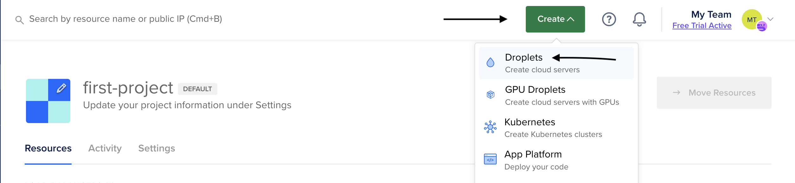
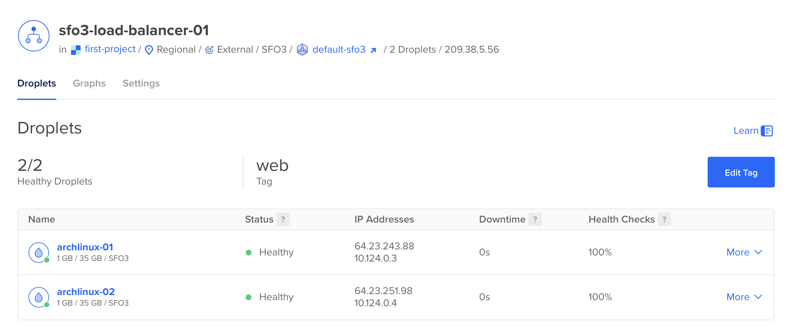
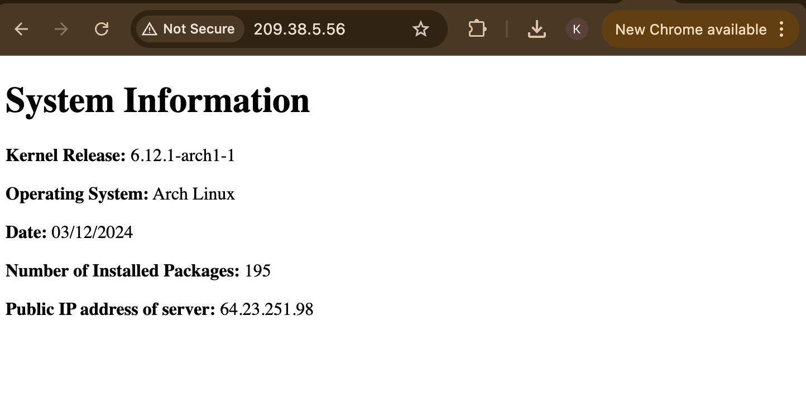
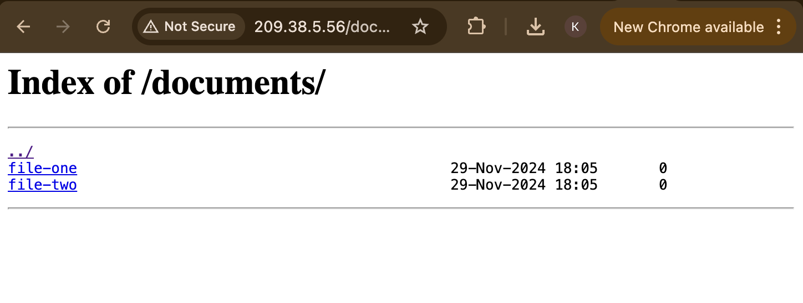

## Assignment 3: Part 2

Setting up DigitalOcean droplets, load balancers and Nginx webserver. 

## Task 1: Setting up two droplets and configuring load balancer. 

1. Go to DigitalOcean and click on the green `create` and then click droplet.

 

2. After clicking droplet, configure your droplet and change quantity to two droplets. Quantity will be seen at the bottom under `Finalize Details`

3. Then click `tags` and enter web as a tag.

4. Finally, click `Create Droplet.`

5. Click the green create button again, and click `load balancers` 

6. When configuring, select the same `data center region` as the two droplets you previously made.

7. Then, click on add droplets and type the tag name `web`

8. Then click `Create load balancer`

If the steps above were done correct, the output should look like this:



You have now completed setting up a `load balancer` and now you can continue to task 2.

## Task 2: Setting up and configuring new droplets and files.

>[!NOTE]
Remember to configure your two new droplets system user, Click this link to set up user
[Assignment-3-p1-user-creation](https://github.com/Basra97/2420-Assignment-3?tab=readme-ov-file#task-1-creation-of-system-user)
Please return once you reach the cloning repository step!

1. Git clone repository. 

Copy and Paste the command below to gain the generate_index starter file. 

```
git clone https://git.sr.ht/~nathan_climbs/2420-as3-p2-start
``` 

2. Moving generate_index file to `/var/lib/webgen/bin` directory. 

```
sudo mv 2420-as3-p2-start/generate_index /var/lib/webgen/bin/
```
>[!NOTE]
You must give `generate_index` permission to be executable. (Part 1 of Assignment 3, Step 4.)

Copy and Paste the command to give it permission. 

``` 
sudo chmod +x /var/lib/webgen/bin/generate_index
```

3. Create a documents directory in `webgen` directory.

```
sudo mkdir /var/lib/webgen/documents
``` 
4. Create two files, `file-one` and `file-two` in the `webgen/documents` directory. 

```
sudo touch /var/lib/webgen/documents/file-one 
```

```
sudo touch /var/lib/webgen/documents/file-two
```

5. Create a index.html file in `webgen/HTML` directory.

```
sudo touch /var/lib/webgen/HTML/index.html
```

6. Setting ownership

```
sudo chown -R webgen:webgen /var/lib/webgen
```

>[!NOTE]
To see the directory structure, install tree by copying the following command
``` 
sudo pacman -S tree
```
then

```
tree /var/lib/webgen
```
Use the above to verify your directory structure. 

7. Go to task 2 in part 1 to configure the rest
[Assignment-3-p1-Creation of service and timer scripts](https://github.com/Basra97/2420-Assignment-3?tab=readme-ov-file#task-2-creation-of-service-and-timer-scripts)

>[!IMPORTANT] 
Complete until Task 3: step 5, then return and copy and paste the new server block below.

## Task 3: Modifying nginx file and creating a new server block to include a file server. 

1. New server block configuration 

```
sudo nvim /etc/nginx/sites-available/webgen
```

Copy and paste the following server block into the `webgen` server block file. 

```
server {
   listen 80;
   server_name <droplet-ip>;

    location / {
       root /var/lib/webgen/HTML;
       index index.html;
       try_files $uri $uri/ =404;
   }

   location /documents {
       alias /var/lib/webgen/documents/;
       autoindex on;
       autoindex_exact_size off;
       autoindex_localtime on;
       try_files $uri $uri/ =404;
   }
}
```
>[!NOTE]
Put your droplet ip in the server_name. 

2. Now continue on from where you left off in part 1.(Task 3: step 6)
[Task 3: Configuration of nginx and creation of Server Blocks](https://github.com/Basra97/2420-Assignment-3?tab=readme-ov-file#task-3-configuration-of-nginx-and-creation-of-server-blocks)

>[!NOTE]
Follow part 1 until Task 5: System Information Page, then return to do the task 4: Load Balancer system information. 

note to self: add internal link above.

## Task 4: Load Balancer system information page

1. Droplet IP Address

To find your droplets' IP address, go to DigitalOcean and click the droplet section and copy the two new droplets ip works, and then also the load balancers IP.  

Then

Go to your preferred browser and type.

```
http://droplet-ip
```




if working, open the URL, and add `/documents` to the end of the IP.

```
http://droplet-ip/documents
```

Your page should be like this.



You have successfully completed the assignment 3-part-2 tasks!

